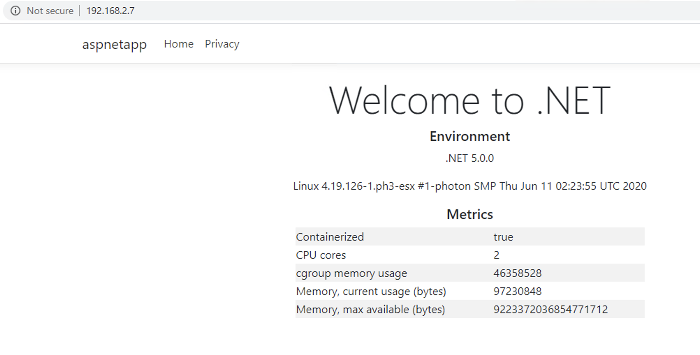
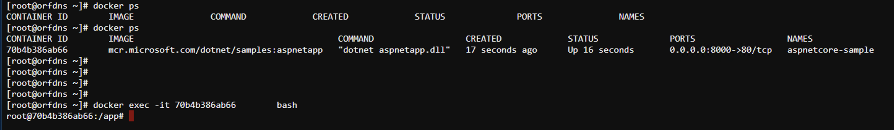

# .Net core example
Load up sample .Netcore image from Microsoft and load inot local docker and then load into local Regestry (Harbor). 
Then create yaml file and load into a Kubernetes cluster

Pull image from Microsoft
```
docker pull mcr.microsoft.com/dotnet/samples:dotnetapp 
```
Run docker container local
```
docker run -it --rm -p 8000:80 --name aspnetcore-sample mcr.microsoft.com/dotnet/samples:aspnetapp
```
Check in browser
```
http://10.197.79.2:8000/
```
** Should look like this **



Look at running docker images
```
docker ps
```


Exec into the running container to make changes
```
	docker exec -it 70b4b386ab66 bash

	cd /app/wwwroot/css
	cat site.css | sed 's/border-top: 1px solid/border-top: 20px solid/' > a
	cp a site.css
	exit
```
Save the running container
```
docker commit aspnetcore-sample
```
Find the unnamed image (look for newest image ID named none)
```
docker images
```
Tag the new image
```
docker tag a6bbe73fe605 dotnetbigborder
```
Run the new image
```
docker run -it --rm -p 8000:80 --name aspnetcore-sample dotnetbigborder 
```
Exec into new container and check changes
```
docker ps
	docker exec -it 70b4b386ab66 bash
	cat /app/wwwroot/css/site.css
	ls /app/wwwroot/css/
```
Save original image off
```
docker save mcr.microsoft.com/dotnet/samples > aspnetcore-sample.tar
```
Potentually clean docker images (prune/rm)

Load the image into docker
```
docker load --input aspnetcore-sample.tar
```
Run (test) the container
```
docker run -it --rm -p 8000:80 --name aspnetcore-sample mcr.microsoft.com/dotnet/samples:aspnetapp
```
Tag images and send to registry

	Example for google
```
	docker tag mcr.microsoft.com/dotnet/samples:latest gcr.io/boreax-rain-256000/dotnetsamples:latest
	docker tag mcr.microsoft.com/dotnet/samples:dotnetapp gcr.io/boreax-rain-256000/dotnetsamples:dotnetapp
	docker tag mcr.microsoft.com/dotnet/samples:aspnetapp gcr.io/boreax-rain-256000/dotnetsamples:aspnetapp
	docker push gcr.io/boreax-rain-256000/dotnetsamples:latest
	docker push gcr.io/boreax-rain-256000/dotnetsamples:dotnetapp
	docker push gcr.io/boreax-rain-256000/dotnetsamples:aspnetapp
```
	Example for local registry
```
	docker tag mcr.microsoft.com/dotnet/samples:latest harbor.lab.local/librar/dotnetsamples:latest
	docker tag mcr.microsoft.com/dotnet/samples:dotnetapp harbor.lab.local/librar/dotnetsamples:dotnetapp
	docker tag mcr.microsoft.com/dotnet/samples:aspnetapp harbor.lab.local/library/dotnetsamples:aspnetapp
	docker login harbor2.lab.local -u administrator@vsphere.local
	docker push harbor.lab.local/library/dotnetsamples:latest
	docker push harbor.lab.local/library/dotnetsamples:dotnetapp
	docker push harbor.lab.local/library/dotnetsamples:aspnetapp
```

Create yaml file for Kubernetes (dotnet1.yaml)
	change the image: line to local harbor location!
```
apiVersion: v1
kind: Service
metadata:
  labels:
    name: aspnetcore-sample
  name: aspnetcore-sample
spec:
  ports:
    - port: 80
  selector:
    app: aspnetcore-sample
  type: LoadBalancer

---
apiVersion: apps/v1
kind: Deployment
metadata:
  name: aspnetcore-sample
spec:
  selector:
    matchLabels:
      app: aspnetcore-sample
  replicas: 1
  template:
    metadata:
      labels:
        app: aspnetcore-sample
    spec:
      containers:
      - name: aspnetcore-sample
        image: mcr.microsoft.com/dotnet/samples:aspnetapp
        ports:
        - containerPort: 80
```
 
Log onto kubernetes cluster and load .net application and test
```
	kubectl apply -f ./dotnet1.yaml
	kubectl get pods
	kubectl get svc
	http://192.168.2.7/
```
